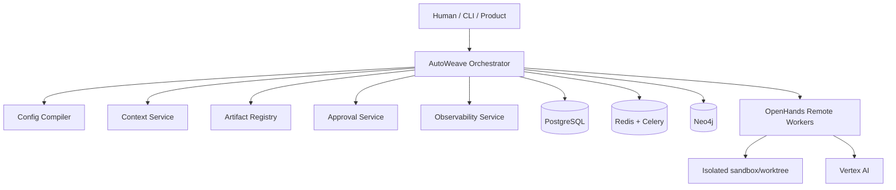

<div align="center">

# AutoWeave

**Terminal-first multi-agent orchestration library built around OpenHands remote workers and Vertex AI.**

[](https://github.com/hypnoastic/Autoweave/actions/workflows/ci.yml)
[](https://github.com/hypnoastic/Autoweave/actions/workflows/security.yml)
[](#testing)
[](https://python.org)
[](LICENSE)
[](https://docs.astral.sh/ruff/)

[Architecture](#architecture) · [Quick Start](#quick-start) · [Development](#development) · [Testing](#testing) · [Contributing](#contributing)

</div>

---

## What is AutoWeave?

AutoWeave is the **execution engine** for multi-agent software engineering teams. It orchestrates specialized AI agents as a coherent team — managing workflow compilation, task graphs, queue-backed durable execution, and human-in-the-loop approvals.

**AutoWeave owns orchestration.** OpenHands owns single-agent execution. They are deliberately separated:

| Concern | Owner |
|---|---|
| Workflow state, task graphs, DAG scheduling | **AutoWeave** |
| Approvals, context, memory, artifact routing | **AutoWeave** |
| Model routing, observability, audit trail | **AutoWeave** |
| Single-agent tool use, file editing, commands | **OpenHands** |
| Sandbox isolation, step-level agent behavior | **OpenHands** |

### Key Features

- 🔀 **Workflow Orchestration** — Define, compile, and execute DAGs of agentic tasks with dependency-aware dynamic scheduling
- 💾 **Durable State** — Resume paused runs, track attempts, persist context safely across PostgreSQL
- 🤝 **Human-in-the-Loop** — Native primitives for pausing execution to request approvals or clarifications
- 📋 **Queue Dispatch** — Offload long-running tasks to Celery workers backed by Redis
- 🔍 **Local Monitoring** — Inspect runs via a lightweight local dashboard and playground
- 🧠 **Context Layered Resolution** — Workspace → Postgres → pgvector → Artifact Store → Neo4j → Redis → typed miss escalation
- 📊 **Observability** — OpenTelemetry-compatible spans, metrics, and domain events

---

## Architecture



**Core Architecture Principles:**

1. **Single orchestrator rule** — AutoWeave is the only workflow authority
2. **Workers are execution engines** — OpenHands executes one task attempt at a time; it does not own the DAG
3. **Source-of-truth discipline** — PostgreSQL is canonical, Redis is ephemeral, Neo4j projects graph queries
4. **Human intervention is first-class** — Clarifications, approvals, and overrides are formal workflow objects
5. **One sandbox per task attempt** — Isolated worktree per execution

> 📖 See [docs/ARCHITECTURE.md](docs/ARCHITECTURE.md) for the complete architecture specification.

---

## Project Structure

```
autoweave/
├── autoweave/                 # Core library package
│   ├── approvals/             # Human approval service
│   ├── artifacts/             # Artifact storage & registry
│   ├── compiler/              # Workflow config compiler
│   ├── context/               # Context resolution service
│   ├── events/                # Domain event system
│   ├── graph/                 # Neo4j graph backend & projections
│   ├── memory/                # Memory layers (episodic, semantic, procedural)
│   ├── monitoring/            # Dashboard, metrics, web server
│   ├── observability/         # OpenTelemetry tracing & metrics export
│   ├── orchestration/         # Core orchestration engine & scheduler
│   ├── routing/               # Model routing policies
│   ├── storage/               # PostgreSQL durable storage & repositories
│   ├── templates/             # Project bootstrapping templates
│   ├── workers/               # OpenHands worker runtime management
│   ├── workflows/             # Workflow specification & parsing
│   ├── models.py              # Canonical domain models (Pydantic)
│   ├── settings.py            # Environment & configuration management
│   └── local_runtime.py       # Local development runtime
├── apps/
│   └── cli/                   # Typer CLI application
├── tests/                     # Test suite (pytest)
├── scripts/                   # Automation scripts
├── docs/                      # Architecture & design documentation
├── config/                    # Runtime configuration (secrets, profiles)
├── pyproject.toml             # Package configuration & tool settings
├── Makefile                   # Developer workflow automation
├── Dockerfile                 # Container image
└── docker-compose.yml         # Full stack (Redis, OpenHands, runtime)
```

---

## Quick Start

### Prerequisites

- **Python** ≥ 3.10
- **[uv](https://docs.astral.sh/uv/)** (recommended) or pip

### Installation

```bash
# Via uv (recommended)
uv pip install autoweave

# Via pip
pip install autoweave
```

### Initialize a Project

```bash
# Create and bootstrap a new project
autoweave new-project ./my-weave-project
autoweave bootstrap --root ./my-weave-project
```

### Run a Workflow

```bash
autoweave run-workflow \
    --root ./my-weave-project \
    --request "Write a script that prints Hello World"
```

### Start the Monitoring UI

```bash
autoweave ui --root ./my-weave-project
# Navigate to http://localhost:8765
```

### Programmatic Usage

```python
from autoweave.orchestration.runtime import build_local_runtime

runtime = build_local_runtime(root_path="./my-project")

workflow_run = runtime.launch_workflow(
    request="Review the backend contract and propose next steps"
)
print(f"Started run: {workflow_run.id}")
```

---

## Development

### Local Setup

```bash
# Clone the repository
git clone https://github.com/hypnoastic/Autoweave.git
cd Autoweave

# Install in development mode
uv pip install -e ".[dev]"

# Install pre-commit hooks
pre-commit install

# Copy environment template
cp .env.example .env.local
```

### Docker Setup (Full Stack)

```bash
# Start all services (Redis, OpenHands, runtime)
docker compose up -d

# Verify services are healthy
docker compose ps
```

### Environment Variables

See [`.env.example`](.env.example) for all configuration options. Key variables:

| Variable | Description | Default |
|---|---|---|
| `VERTEXAI_PROJECT` | Google Cloud project ID | — |
| `VERTEXAI_LOCATION` | Vertex AI region | `global` |
| `REDIS_URL` | Redis connection URL | `redis://127.0.0.1:6379/0` |
| `POSTGRES_URL` | PostgreSQL connection URL | — |
| `NEO4J_URL` | Neo4j connection URL | — |
| `OPENHANDS_AGENT_SERVER_BASE_URL` | OpenHands server URL | `http://127.0.0.1:8000` |

> 📖 See [DEVELOPMENT.md](DEVELOPMENT.md) for the complete development guide.

---

## Testing

AutoWeave enforces **80% minimum coverage** and validates across multiple dimensions:

| Area | Tool | Target |
|---|---|---|
| Unit Tests | pytest | 80%+ coverage |
| Integration Tests | pytest | Main flows pass |
| Type Safety | mypy | No type errors |
| UI/Docs Tests | pytest-playwright | Main pages pass |
| Security | pip-audit, CodeQL | No high/critical CVEs |
| Package | smoke_test.sh | Build, install, import |

```bash
# Run all tests
make test

# Run with coverage reporting
make test:coverage

# Run only unit tests
make test:unit

# Run integration tests
make test:integration

# Run UI tests (requires Playwright)
make test:ui
```

> 📖 See [TESTING.md](TESTING.md) for the full testing philosophy and guidelines.

---

## Quality Checks

```bash
# Run all quality checks (lint + typecheck + test)
make check

# Individual checks
make lint              # Ruff linting & format check
make typecheck         # Mypy type checking
make format            # Auto-fix formatting
make security:audit    # Dependency vulnerability scan

# Build & validate
make build             # Build wheel package
make pack:check        # Build + smoke test

# Project health
make health            # Generate project health report
```

---

## CI/CD

Every pull request is automatically validated:

- ✅ **Lint** — Ruff checks and format verification
- ✅ **Type Check** — Mypy validation
- ✅ **Test** — Full pytest suite with coverage (Python 3.10, 3.11, 3.12 matrix)
- ✅ **Build** — Wheel build + package smoke test
- ✅ **Security** — CodeQL analysis + dependency audit + secret scanning
- ✅ **Health** — Automated project health report generation

Releases are automated via Git tags (`v*.*.*`) → PyPI publish.

---

## Roadmap

- [ ] pgvector semantic retrieval integration
- [ ] Multi-provider model routing (beyond Vertex AI)
- [ ] WebSocket-based real-time monitoring
- [ ] Plugin system for custom workflow steps
- [ ] GitHub App integration for PR-driven workflows
- [ ] Distributed tracing dashboard
- [ ] Performance benchmarking suite

---

## Contributing

We welcome contributions! Please see our [Contributing Guide](CONTRIBUTING.md) for details on:

- Development setup
- Coding standards
- Commit conventions
- Pull request process
- Review checklist

## Security

Security is a first-class concern. See our [Security Policy](SECURITY.md) for:

- Threat model
- Reporting vulnerabilities
- Security defenses

## Maintainers

- [@hypnoastic](https://github.com/hypnoastic)

## License

This project is licensed under the MIT License — see the [LICENSE](LICENSE) file for details.
