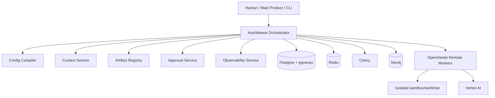
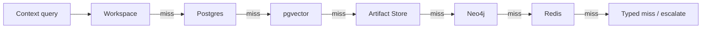

# AutoWeave High-Level Architecture

Version: 2.0  
Status: frozen architecture baseline  
Primary runtime: **OpenHands agent-server remote workers**  
Primary model platform: **Google Vertex AI**  
Primary operator surface: **terminal-first application / library-first control plane**

---

## 1. Executive Summary

AutoWeave is a **multi-agent orchestration and control-plane library**.

It is not a clone of OpenHands, and it is not a thin wrapper around OpenHands.

The system is split deliberately:

- **AutoWeave** owns orchestration, workflow state, task graphs, approvals, context and memory services, artifact routing, model routing, observability, auditability, and policy.
- **OpenHands** owns single-agent execution inside an isolated remote sandbox/workspace: tool use, file editing, command execution, local skill loading, and step-level agent behavior.

The key architecture decisions are:

1. **OpenHands runs through agent-server remote workers**. Embedded local mode may exist for developer convenience, but remote workers are the production architecture.
2. **AutoWeave owns the canonical schema**. AutoWeave compiles canonical agent/task/runtime state into OpenHands-facing run config.
3. **Vertex AI is the primary model platform**. Credentials are injected into workers by the AutoWeave runtime; agents do not log in interactively.
4. **PostgreSQL is the source of truth** for durable state.
5. **Redis + Celery** provide ephemeral coordination, queues, leases, heartbeats, and background execution.
6. **Neo4j is included** for both relationship traversal and graph-oriented retrieval, but it is still downstream of canonical truth.
7. **Agents retrieve context through tools/services**, not by receiving giant prepacked prompts.
8. **One sandbox/worktree per task attempt** is the default.
9. **Dynamic parallelism is orchestrator-controlled**. Independent branches fan out automatically when dependencies and policy allow.
10. **Observability is exported through AutoWeave-normalized events, spans, and metrics**, not by exposing raw OpenHands internals directly to the main product.

---

## 2. Product Goals

### Goals

1. Orchestrate specialized agents as one coherent engineering team.
2. Keep durable system truth outside worker-local state.
3. Support dynamic task decomposition, dependency-aware scheduling, human clarification, approvals, retries, and resumability.
4. Provide precise context retrieval and memory layers without uncontrolled prompt bloat.
5. Preserve full provenance: which agent did what, when, with which inputs, outputs, and approvals.
6. Expose clean telemetry and history to a future main product.
7. Start coding-first while remaining extensible to non-coding workflows later.

### Non-goals

1. Rebuild OpenHands' internal reasoning and tool loop.
2. Use a shared mutable workspace for all agents.
3. Give agents raw SQL or raw graph query access.
4. Depend on worker-local file persistence as the distributed source of truth.
5. Make peer-to-peer free-form chat the main coordination mechanism.
6. Build the product UI in phase one.

---

## 3. System Context

---

## 4. Storage Architecture

AutoWeave relies on a polyglot persistence architecture to handle different workloads efficiently.

### Source of Truth: PostgreSQL
All canonical state resides in PostgreSQL. This includes:
- Workflow Definitions and Runs
- Tasks and Task Attempts
- Domain Events (Event Sourced log)
- Artifact Metadata
- Approvals and Human Requests

### Queue & Ephemeral State: Redis
Used for:
- Celery Task Queues
- Distributed Locks and Leases
- Ephemeral Heartbeats

### Vector & Semantic Search: pgvector
Used to index and search textual context quickly based on embeddings.

### Graph Projections: Neo4j
Graph structures (Task DAGs, Artifact provenance, memory associations) are projected asynchronously to Neo4j. It answers graph-traversal queries that are inefficient in SQL.

---

## 5. Deployment Architecture

AutoWeave is primarily a library, but the recommended local deployment stack relies on Docker Compose.

See [DEPLOYMENT.md](DEPLOYMENT.md) for details on container orchestration and scaling.

---

## 6. Context Resolution Stack

Context is resolved through a fallback mechanism, ensuring the agent gets the freshest and most accurate information available without overflowing the context window.

