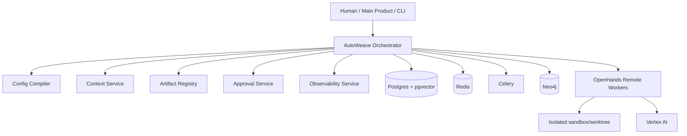
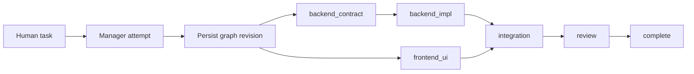
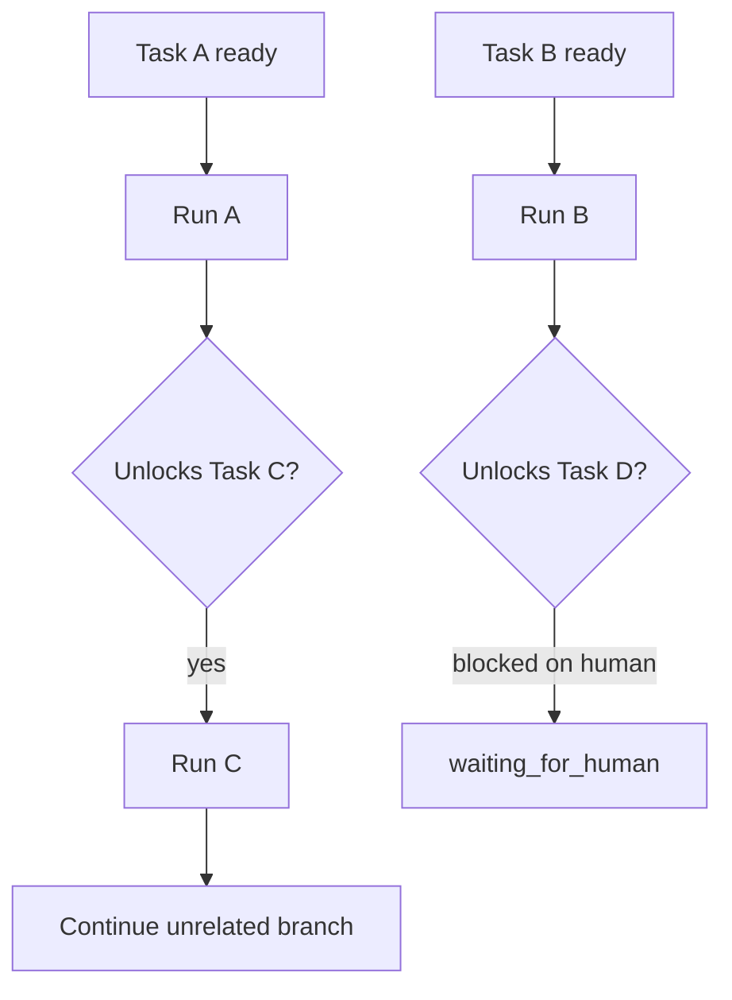
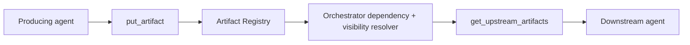
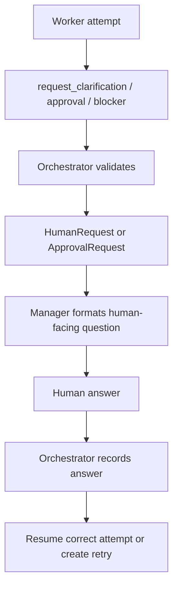
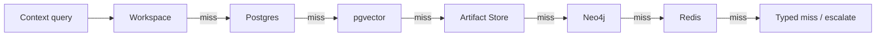
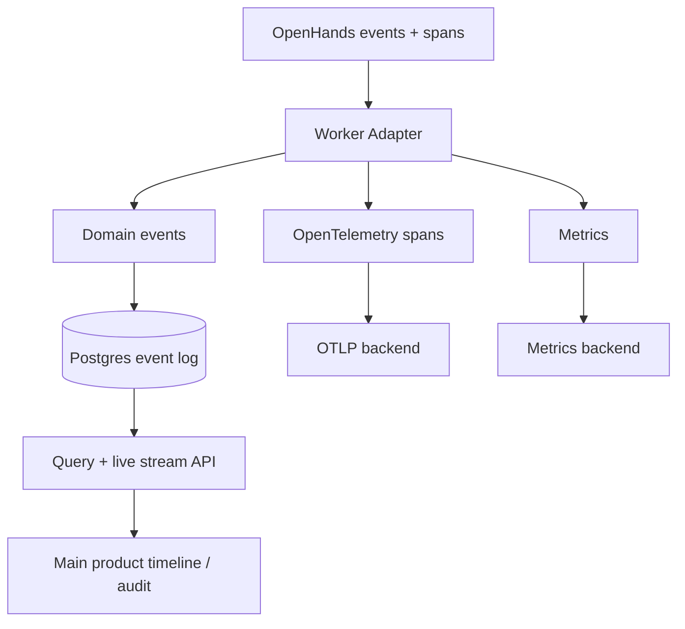
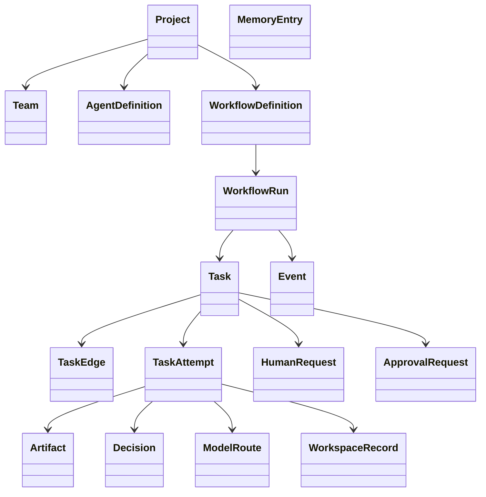
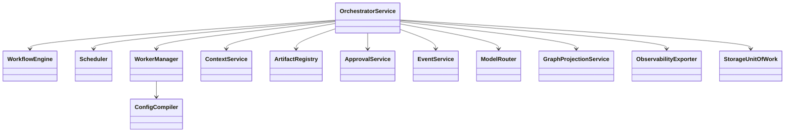
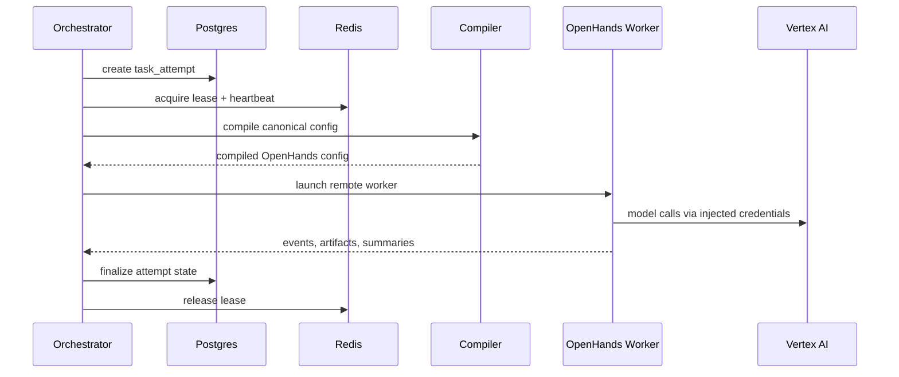

# AutoWeave Diagrams Source

Version: 2.0
Purpose: text-first diagrams for coding agents and PDF generation.

---

## 1. System context

```text
Human / Main Product / CLI
  -> AutoWeave Orchestrator
     -> Config Compiler
     -> Context Service
     -> Artifact Registry
     -> Approval Service
     -> Event / Observability Service
     -> Postgres + pgvector
     -> Redis + Celery
     -> Neo4j
     -> OpenHands agent-server workers
        -> isolated sandbox/worktree per task attempt
        -> Vertex AI model calls through injected worker credentials
```



---

## 2. Manager -> backend/frontend -> integration -> review



---

## 3. Dynamic scheduling rules

```text
If all hard dependencies complete and no approval/human gate blocks the task,
then the task becomes READY and the scheduler may fan it out immediately.
Only downstream chains of blocked tasks pause.
Unrelated branches continue.
```



---

## 4. Artifact handoff



---

## 5. Human-in-the-loop



---

## 6. Context resolution stack

```text
1. workspace/live files
2. Postgres structured records
3. pgvector semantic retrieval
4. artifact store
5. Neo4j traversal
6. Redis live state
7. typed miss / human escalation
```



---

## 7. Observability export



---

## 8. Core domain classes



---

## 9. Service classes



---

## 10. Worker lifecycle


