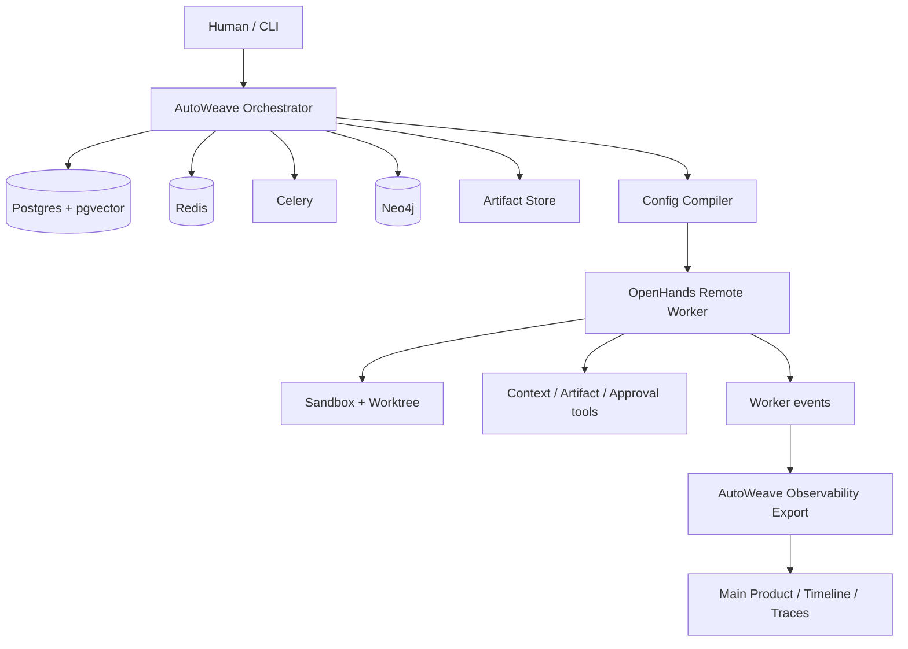
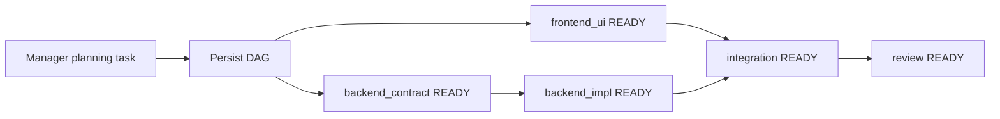
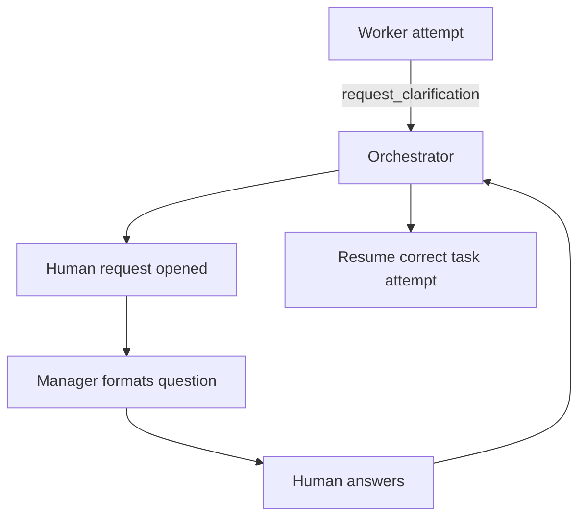
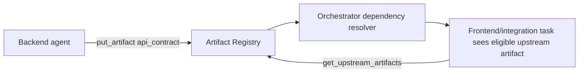
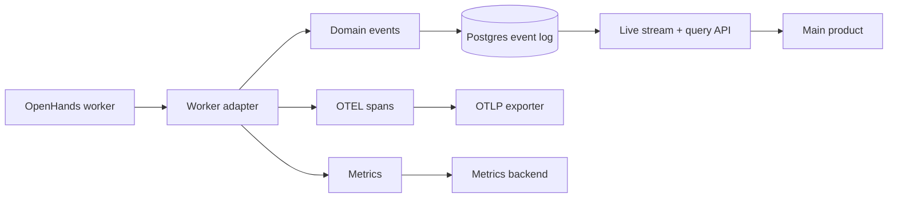

# AutoWeave High-Level Architecture

Version: 2.0  
Status: frozen architecture baseline  
Primary runtime: **OpenHands agent-server remote workers**  
Primary model platform: **Google Vertex AI**  
Primary operator surface: **terminal-first application / library-first control plane**

---

## 1. Executive summary

AutoWeave is a **multi-agent orchestration and control-plane library**.

It is not a clone of OpenHands, and it is not a thin wrapper around OpenHands.

The system is split deliberately:

- **AutoWeave** owns orchestration, workflow state, task graphs, approvals, context and memory services, artifact routing, model routing, observability, auditability, and policy.
- **OpenHands** owns single-agent execution inside an isolated remote sandbox/workspace: tool use, file editing, command execution, local skill loading, and step-level agent behavior.

The key architecture decisions are:

1. **OpenHands runs through agent-server remote workers**. Embedded local mode may exist for developer convenience, but remote workers are the production architecture.
2. **AutoWeave owns the canonical schema**. AutoWeave compiles canonical agent/task/runtime state into OpenHands-facing run config.
3. **Vertex AI is the primary model platform**. Credentials are injected into workers by the AutoWeave runtime; agents do not log in interactively.
4. **PostgreSQL is the source of truth** for durable state.
5. **Redis + Celery** provide ephemeral coordination, queues, leases, heartbeats, and background execution.
6. **Neo4j is included** for both relationship traversal and graph-oriented retrieval, but it is still downstream of canonical truth.
7. **Agents retrieve context through tools/services**, not by receiving giant prepacked prompts.
8. **One sandbox/worktree per task attempt** is the default.
9. **Dynamic parallelism is orchestrator-controlled**. Independent branches fan out automatically when dependencies and policy allow.
10. **Observability is exported through AutoWeave-normalized events, spans, and metrics**, not by exposing raw OpenHands internals directly to the main product.

---

## 2. Product goals

### Goals

1. Orchestrate specialized agents as one coherent engineering team.
2. Keep durable system truth outside worker-local state.
3. Support dynamic task decomposition, dependency-aware scheduling, human clarification, approvals, retries, and resumability.
4. Provide precise context retrieval and memory layers without uncontrolled prompt bloat.
5. Preserve full provenance: which agent did what, when, with which inputs, outputs, and approvals.
6. Expose clean telemetry and history to a future main product.
7. Start coding-first while remaining extensible to non-coding workflows later.

### Non-goals

1. Rebuild OpenHands' internal reasoning and tool loop.
2. Use a shared mutable workspace for all agents.
3. Give agents raw SQL or raw graph query access.
4. Depend on worker-local file persistence as the distributed source of truth.
5. Make peer-to-peer free-form chat the main coordination mechanism.
6. Build the product UI in phase one.

---

## 3. Architecture principles

1. **Single orchestrator rule**  
   AutoWeave is the only workflow authority.

2. **Workers are execution engines, not workflow engines**  
   OpenHands executes one task attempt at a time; it does not own the team DAG.

3. **Structured handoff beats free chat**  
   Agents coordinate mainly through tasks, artifacts, decisions, approvals, and events.

4. **Source-of-truth discipline**  
   Postgres is canonical. Redis is ephemeral. Celery executes. Neo4j projects and answers graph-heavy queries. Sandboxes hold working copies.

5. **Context is layered and scoped**  
   Agent identity context, live run context, durable scoped memory, and shared project memory are distinct.

6. **Human intervention is first-class**  
   Clarifications, approvals, and overrides are formal workflow objects.

7. **Compilation over duplication**  
   AutoWeave stores canonical config and compiles worker-facing OpenHands config just in time.

8. **Observability is productized**  
   The library emits domain events, spans, metrics, and replay artifacts that the main product can consume directly.

---

## 4. System layers

### 4.1 Control plane

- CLI / terminal application
- orchestrator service
- workflow compiler and scheduler
- agent registry and config compiler
- model router
- context and memory service
- artifact registry
- approval and clarification service
- event and audit service
- observability exporter
- graph projection service

### 4.2 Worker plane

- OpenHands agent-server remote workers
- one remote sandbox/worktree per task attempt
- compiled OpenHands run config per attempt
- worker-local tool use, bash, file edits, and local workspace reads
- worker access to AutoWeave MCP/context tools

### 4.3 Storage plane

- PostgreSQL + pgvector
- Redis
- Celery
- Neo4j
- object/blob storage for heavy artifacts and logs
- Git worktrees and sandbox-local filesystems

### 4.4 Observability plane

- normalized domain events persisted by AutoWeave
- OpenTelemetry spans and correlations
- metrics aggregation
- live stream API (SSE/WebSocket)
- query API for history/audit
- replay/debug artifacts for deep inspection

---

## 5. Responsibility boundary

### AutoWeave owns

- workflow definitions and workflow runs
- task graph creation, mutation, and evaluation
- human approval and clarification lifecycles
- canonical task and attempt state
- memory namespaces, retrieval policy, writeback policy, compaction policy
- artifact registry and visibility policy
- Vertex AI model-routing policy
- dispatch, retries, fan-out, and resume logic
- audit history and observability export
- graph projection into Neo4j
- policy and secret distribution to workers

### OpenHands owns

- one attempt's reasoning/action loop
- worker-local tool execution
- file edits in the attempt workspace
- command execution in the attempt sandbox
- local skill loading and prompt shaping after AutoWeave compilation
- worker-local confirmation/step-level safety behavior

---

## 6. Canonical data-flow

```text
Human / CLI
  -> AutoWeave Orchestrator
     -> Postgres (truth)
     -> Redis (leases, queues, heartbeats)
     -> Celery (dispatch/background jobs)
     -> Neo4j (graph projection + graph retrieval)
     -> Artifact Store
     -> OpenHands Remote Worker
         -> Sandbox / Worktree / Repo Copy
         -> AutoWeave Context + Artifact + Approval tools
  -> AutoWeave Event / Trace / Metric export
  -> Main product / dashboards / replay
```

---

## 7. Workflow model and dynamic parallelism

AutoWeave executes a **task DAG**, not a linear queue.

Each task has:
- assigned role
- state
- hard and soft dependency edges
- expected artifact outputs
- optional approval requirements
- optional human-interaction rules
- model-routing hints
- memory scopes

A task is runnable when:
- state is `ready`
- all hard dependencies are satisfied
- required approvals are present
- required human blockers are cleared
- a worker lease can be acquired

### Dynamic parallelism

Dynamic parallelism means:
- the orchestrator reevaluates the runnable set after every material event
- any independent tasks become runnable immediately
- only downstream chains of blocked tasks pause
- unrelated branches continue

### Example

Request: **“Build notifications settings page with backend API support.”**

Manager proposes:
- `backend_contract`
- `backend_impl`
- `frontend_ui`
- `integration`
- `review`

Dependencies:
- `backend_impl` depends on `backend_contract`
- `integration` depends on `backend_impl` and `frontend_ui`
- `review` depends on `integration`

Runtime behavior:
- `backend_contract` and `frontend_ui` may start in parallel
- when `backend_contract` completes, `backend_impl` becomes runnable
- when `backend_impl` and `frontend_ui` complete, `integration` becomes runnable
- if `integration` blocks on human clarification, only `integration -> review` pauses
- unrelated branches would continue

---

## 8. Cross-agent coordination and artifact handoff

Agents do **not** pass files peer-to-peer as the primary mechanism.

The model is:

```text
Producing agent
  -> put_artifact / record_decision
  -> AutoWeave artifact registry + decision log
  -> orchestrator attaches eligible upstream outputs to dependent tasks
  -> downstream agent retrieves through tools
```

### Coordination objects

- tasks
- task dependencies
- artifacts
- decisions
- approvals
- human requests
- state transitions
- reviewer feedback

### Default artifact visibility

A task can see:
- its own task inputs
- explicitly attached artifacts
- eligible upstream artifacts from dependency-linked tasks
- role-allowed shared/project artifacts

A task cannot automatically see:
- artifacts from unrelated workflows
- sensitive artifacts outside its policy scope
- draft artifacts unless the workflow explicitly allows draft consumption

### Artifact lifecycle

- `draft`
- `final`
- `superseded`
- `archived`

---

## 9. Human-in-the-loop model

Workers do not directly mutate canonical workflow state.

A worker may request:
- clarification
- approval
- state transition
- escalation
- blocker reporting

AutoWeave validates and persists the real transition.

### Human loop flow

1. worker reports a blocker or clarification need
2. orchestrator records `human_request`
3. task moves to `waiting_for_human` or `waiting_for_approval`
4. manager agent may rewrite the raw worker request into a cleaner human-facing question
5. human answers in terminal/main product
6. orchestrator stores answer, emits events, and resumes the correct task attempt or follow-up attempt

### Important boundary

The manager agent is the **human-facing conversational role**, but the orchestrator remains the **state authority**.

---

## 10. Context and memory model

AutoWeave uses layered context.

### 10.1 Agent identity context

Static per agent:
- role
- prompt/soul
- playbook
- tool permissions
- model profile hints
- sandbox profile
- memory scopes

### 10.2 Live run context

Ephemeral per attempt:
- current task brief
- recent tool outputs
- workspace status
- open blockers
- current upstream artifact bindings

### 10.3 Durable memory layers

#### Episodic memory
- workflow runs
- task attempts
- human interactions
- failures
- retries

#### Semantic memory
- facts
- summaries
- decisions
- extracted constraints

#### Procedural memory
- playbooks
- agent policies
- reusable operational rules

#### Code memory
- indexed files/chunks
- summaries
- diffs
- prior fixes
- module history

#### Graph memory
- relationships across tasks, artifacts, files, modules, decisions, agents, and runs

### Retrieval order

When context is requested, the context service resolves in this order:
1. active workspace / local attempt files
2. Postgres structured truth
3. pgvector semantic retrieval
4. artifact/blob store
5. Neo4j relationship traversal
6. Redis live ephemeral state
7. human escalation if still unresolved

### Missing-context policy

Missing context is a first-class result, not a silent failure.

Typed outcomes:
- `not_found`
- `not_indexed_yet`
- `waiting_for_dependency`
- `access_denied`
- `needs_human_input`

---

## 11. Vertex AI model platform

AutoWeave standardizes on **Vertex AI** for production model execution.

### Credential model

- no interactive login inside workers
- production credentials come from the main product / secret manager
- AutoWeave injects the worker environment expected by OpenHands
- local development may use a local secrets file that the runtime converts into worker env

### Canonical runtime secrets

At the AutoWeave layer, use these canonical settings:
- `VERTEXAI_PROJECT`
- `VERTEXAI_LOCATION`
- `VERTEXAI_SERVICE_ACCOUNT_FILE` (local dev) or secret-manager equivalent

At worker compile/injection time, materialize the OpenHands-side env expected by the worker runtime:
- `GOOGLE_APPLICATION_CREDENTIALS`
- `VERTEXAI_PROJECT`
- `VERTEXAI_LOCATION`

### Routing policy

Routing can vary by:
- agent role
- task type
- complexity
- latency target
- cost budget
- reliability/risk level
- retry history

Examples:
- manager/planner -> stronger reasoning profile
- complex backend integration -> stronger coding profile
- boilerplate or low-risk refactor -> cheaper profile
- repeated failure -> escalate route automatically

---

## 12. Sandboxes and workspaces

Default policy:
- one sandbox/worktree per task attempt
- reuse only when resuming the same attempt
- no shared mutable worktree as default

### Why

This prevents:
- file collisions
- hidden contamination between agents
- polluted dependency state
- weak reproducibility
- ambiguous provenance

### Shared elements that are allowed

- same origin repository
- same base container image
- shared package/dependency cache
- shared artifact store
- shared durable memory stores

---

## 13. Observability and export to the main product

The library must export observability in a way the main product can consume without understanding OpenHands internals.

### 13.1 Three observability outputs

#### A. Domain events
Product-facing, normalized, persisted by AutoWeave.

Examples:
- `workflow.created`
- `task.ready`
- `task.blocked`
- `attempt.started`
- `artifact.published`
- `human_request.opened`
- `approval.requested`
- `route.selected`
- `sandbox.orphaned`

#### B. OpenTelemetry spans
Engineering-facing.

Examples:
- workflow compile
- DAG mutation
- task dispatch
- worker start
- context retrieval
- artifact upload
- approval wait
- retry
- Neo4j projection update
- sandbox cleanup

#### C. Metrics
Examples:
- queue latency
- attempt duration
- approval wait time
- retry count
- model-route cost
- blocked-time by reason
- artifact volume
- failure rate by provider/profile

### 13.2 Export model

```text
OpenHands worker events + spans
  -> AutoWeave worker adapter
  -> normalized domain events + correlated spans + metrics
  -> Postgres event log + OTLP exporter + live stream
  -> Main product timeline / dashboards / traces / replay
```

### 13.3 Main product integration

The main product should consume:
- **live stream API** for in-progress runs
- **query API** for history and audit
- **trace backend / OTLP sink** for deep debugging
- **artifact URLs/handles** for drill-down

### Required correlation fields

Every event/span should carry:
- `workflow_run_id`
- `task_id`
- `task_attempt_id`
- `agent_id`
- `agent_role`
- `sandbox_id`
- `provider_name`
- `model_name`
- `route_reason`
- `event_type`
- `source`
- `sequence_no`
- `created_at`

---

## 14. Edge cases and required resolutions

### Workflow / scheduling
- cycle in the task graph -> reject at compile time and on dynamic mutation
- duplicate dispatch -> idempotency keys + DB uniqueness + Redis lease
- blocked branch freezing unrelated work -> only block downstream dependents
- stale upstream artifact version -> bind artifact versions and mark stale consumers

### Human loop
- late human answer after retry/completion -> attach as artifact/comment, do not auto-resume wrong attempt
- multiple raw questions from one task -> consolidate into one human request
- human answer conflicts with prior decision -> require supersede event

### Context / memory
- context missing in Postgres -> fallback layered search, typed miss result
- indexing lag -> return `not_indexed_yet`, retry or read directly from workspace
- noisy writeback -> only durable-write structured artifacts, decisions, blockers, summaries
- compaction losing detail -> store structured compaction output plus raw artifacts/logs

### Workspaces
- sandbox loss mid-run -> attempt remains canonical in Postgres; retry with fresh sandbox and structured resume inputs
- shared worktree collisions -> prevented by one-worktree-per-attempt default
- stale code index vs live workspace -> prefer live workspace for active attempt

### Vertex / routing
- provider outage -> fallback route by policy, log route degradation
- repeated cheap-model failure -> escalate automatically
- route change across retries -> rely on structured summaries and artifact refs rather than raw session continuity

### Graph
- Neo4j and Postgres drift -> Postgres remains canonical; graph updated asynchronously from outbox/events
- graph explosion -> tier graph projection, archive low-value edges, keep critical provenance edges

### Observability
- telemetry backend outage -> main product still reads from AutoWeave event log
- out-of-order worker events -> logical sequence numbers per attempt
- secrets in traces/logs -> redact before persistence/export

---

## 15. Recommended repository layout

```text
autoweave/
  apps/
    cli/
  autoweave/
    approvals/
    artifacts/
    compiler/
    context/
    events/
    graph/
    memory/
    observability/
    orchestration/
    routing/
    storage/
    workers/
    workflows/
  agents/
    manager/
    backend/
    frontend/
    reviewer/
  configs/
    runtime/
    workflows/
    routing/
  docs/
  tests/
  .env.example
  AGENTS.md
```

---

## 16. Text diagrams

### 16.1 End-to-end control flow



### 16.2 Dynamic DAG scheduling



### 16.3 Human-in-the-loop



### 16.4 Artifact handoff



### 16.5 Observability export



---

## 17. Final architecture conclusion

AutoWeave should be implemented as a **Vertex-AI-backed multi-agent control plane** on top of **OpenHands remote workers**, with **Postgres as truth**, **Redis/Celery as coordination**, **Neo4j as graph retrieval/projection**, **isolated worktrees per attempt**, **dynamic DAG scheduling**, and **normalized observability export** for the main product.
