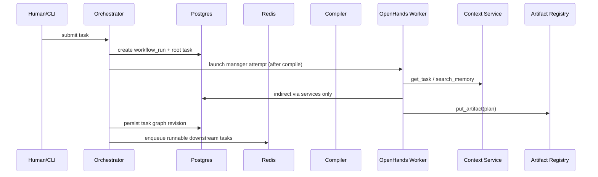
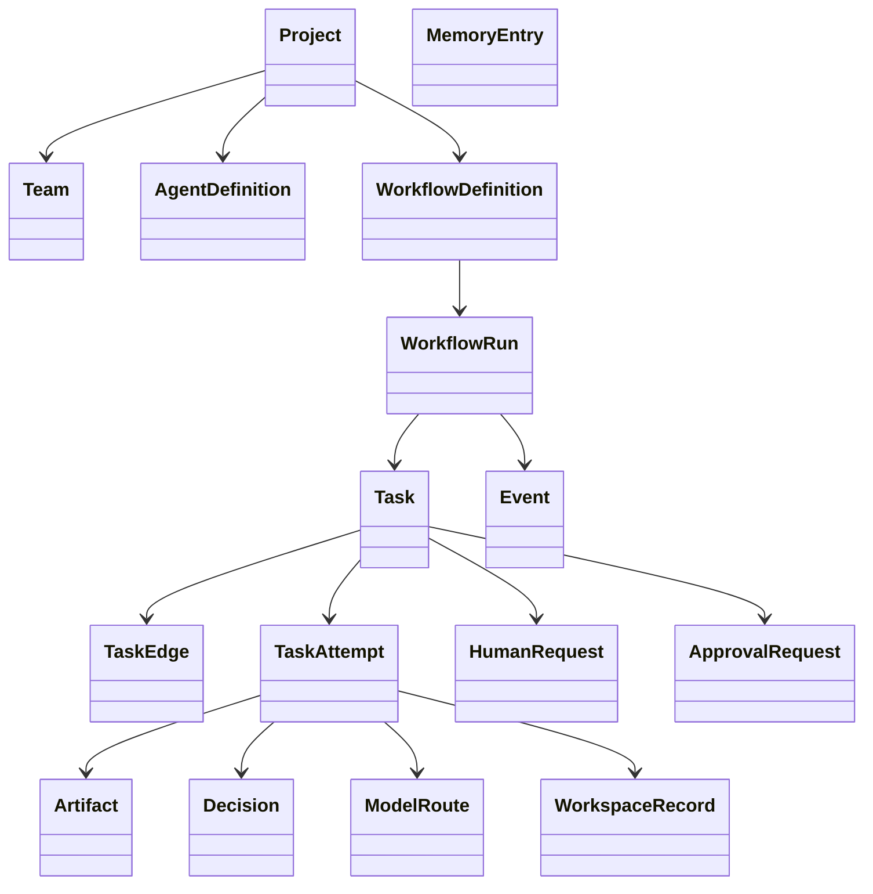
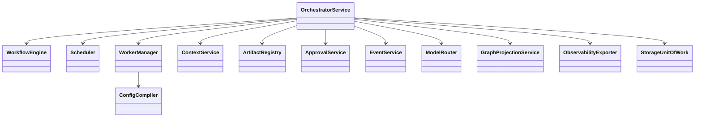

# AutoWeave Implementation Specification

Version: 2.0  
Status: implementation baseline  
Primary runtime: **OpenHands agent-server remote workers**  
Primary model platform: **Google Vertex AI**  
Canonical schema: **AutoWeave-owned; compiled into OpenHands config**

---

## 1. Scope

This document defines the implementation contract for:
- canonical config schema
- orchestrator behavior
- storage schema
- dynamic DAG scheduling
- human-in-the-loop
- context/memory services
- artifact routing
- Vertex AI model routing
- OpenHands worker adapter
- Neo4j projection and retrieval
- observability export
- testing and edge-case coverage

The terminal application and library code are in scope. A graphical product UI is out of scope.

---

## 2. Implementation priorities

### Mandatory
1. Canonical AutoWeave schema and compiler
2. Orchestrator + task DAG engine
3. Postgres source-of-truth repositories
4. Redis leases/heartbeats
5. Remote OpenHands worker adapter
6. Vertex AI routing and credential injection
7. Artifact registry and visibility resolver
8. Human request / approval subsystem
9. Neo4j graph projection + graph lookup interfaces
10. Observability event/trace/metric export
11. Full test harness

### Explicitly deferred
1. GUI product surface
2. public plugin marketplace
3. alternate worker runtimes beyond OpenHands
4. external skill marketplace

---

## 3. Canonical repository and config contract

```text
agents/
  manager/
    soul.md
    playbook.yaml
    autoweave.yaml
    skills/
  backend/
    soul.md
    playbook.yaml
    autoweave.yaml
    skills/
  frontend/
    soul.md
    playbook.yaml
    autoweave.yaml
    skills/
  reviewer/
    soul.md
    playbook.yaml
    autoweave.yaml
    skills/

configs/
  workflows/
    team.workflow.yaml
  routing/
    model_profiles.yaml
  runtime/
    runtime.yaml
    storage.yaml
    vertex.yaml
    observability.yaml

config/
  secrets/
    vertex_service_account.json   # gitignored in local dev

.env.example
.env.local                        # gitignored in local dev
AGENTS.md
context.md
implementation_plan.md
task_list.md
```

### 3.1 Canonical agent files

#### `soul.md`
Agent identity and behavioral guidance.

#### `playbook.yaml`
Machine-readable local operating procedure.

#### `autoweave.yaml`
AutoWeave-owned agent metadata.

Required fields:
- `name`
- `role`
- `description`
- `allowed_workflow_stages`
- `default_memory_scopes`
- `allowed_tool_groups`
- `sandbox_profile`
- `model_profile_hints`
- `approval_policy`
- `human_interaction_policy`
- `artifact_contracts`
- `route_priority`

### 3.2 Workflow definition

`configs/workflows/team.workflow.yaml`

Required top-level fields:
- `name`
- `version`
- `roles`
- `stages`
- `entrypoint`
- `policies`
- `task_templates`
- `completion_rules`

Task template fields:
- `key`
- `title`
- `assigned_role`
- `description_template`
- `hard_dependencies`
- `soft_dependencies`
- `required_artifacts`
- `produced_artifacts`
- `approval_requirements`
- `memory_scopes`
- `route_hints`

### 3.3 Runtime config

#### `runtime.yaml`

- default concurrency
- retry policy
- heartbeat intervals
- cleanup schedules
- compaction thresholds

#### `storage.yaml`
- Postgres DSN name
- Redis DSN name
- Neo4j DSN name
- artifact store config
- pgvector index config

#### `vertex.yaml`
- provider name: `VertexAI`
- profile definitions
- fallback order
- timeout policy
- retry policy
- token/cost budgets

#### `observability.yaml`
- event retention policy
- OTLP exporter config
- metric sinks
- redaction rules
- replay retention windows

---

## 4. Credential model for Vertex AI

### 4.1 Local development contract

Local developers place the GCP service-account JSON at:
- `config/secrets/vertex_service_account.json`

Local ignored environment file:

```env
VERTEXAI_PROJECT=
VERTEXAI_LOCATION=
VERTEXAI_SERVICE_ACCOUNT_FILE=./config/secrets/vertex_service_account.json
POSTGRES_URL=
REDIS_URL=
NEO4J_URL=
NEO4J_USERNAME=
NEO4J_PASSWORD=
ARTIFACT_STORE_URL=
```

### 4.2 Runtime injection contract

The worker adapter converts local/secret-manager config into the OpenHands-side environment expected by the worker runtime:
- `GOOGLE_APPLICATION_CREDENTIALS`
- `VERTEXAI_PROJECT`
- `VERTEXAI_LOCATION`

Implementation note:
- support secret-manager-native injection in production
- support local file-based materialization in dev
- never require interactive login inside workers

### 4.3 Provider selection

OpenHands provider config for production attempts must resolve to:
- `LLM Provider = VertexAI`
- `LLM Model = vertex_ai/<model-name>` or equivalent compiled model string

---

## 5. Core domain model

### 5.1 Primary entities

#### Project
Fields:
- `id`
- `slug`
- `name`
- `repo_url`
- `default_branch`
- `settings_json`
- `created_at`
- `updated_at`

#### Team
Fields:
- `id`
- `project_id`
- `name`
- `workflow_definition_id`
- `status`
- `created_at`
- `updated_at`

#### AgentDefinition
Fields:
- `id`
- `project_id`
- `role`
- `name`
- `version`
- `soul_md`
- `playbook_yaml`
- `autoweave_yaml`
- `status`
- `created_at`
- `updated_at`

#### WorkflowDefinition
Fields:
- `id`
- `project_id`
- `version`
- `content_yaml`
- `checksum`
- `status`
- `created_at`

#### WorkflowRun
Fields:
- `id`
- `project_id`
- `team_id`
- `workflow_definition_id`
- `graph_revision`
- `root_input_json`
- `status`
- `started_at`
- `ended_at`

#### Task
Fields:
- `id`
- `workflow_run_id`
- `task_key`
- `title`
- `description`
- `assigned_role`
- `state`
- `priority`
- `input_json`
- `output_json`
- `required_artifact_types_json`
- `produced_artifact_types_json`
- `created_at`
- `updated_at`

#### TaskEdge
Fields:
- `id`
- `workflow_run_id`
- `from_task_id`
- `to_task_id`
- `edge_type`
- `is_hard_dependency`
- `created_at`

#### TaskAttempt
Fields:
- `id`
- `task_id`
- `attempt_number`
- `state`
- `worker_mode`
- `agent_definition_id`
- `workspace_id`
- `compiled_worker_config_json`
- `model_route_id`
- `lease_key`
- `started_at`
- `ended_at`

#### Artifact
Fields:
- `id`
- `workflow_run_id`
- `task_id`
- `task_attempt_id`
- `produced_by_role`
- `artifact_type`
- `title`
- `summary`
- `status`
- `version`
- `storage_uri`
- `checksum`
- `metadata_json`
- `created_at`

#### Decision
Fields:
- `id`
- `workflow_run_id`
- `task_id`
- `task_attempt_id`
- `title`
- `decision_text`
- `rationale`
- `status`
- `created_at`

#### MemoryEntry
Fields:
- `id`
- `project_id`
- `scope_type`
- `scope_id`
- `memory_layer`
- `content`
- `metadata_json`
- `valid_from`
- `valid_to`
- `created_at`

#### HumanRequest
Fields:
- `id`
- `workflow_run_id`
- `task_id`
- `task_attempt_id`
- `request_type`
- `question`
- `context_summary`
- `status`
- `answer_text`
- `answered_by`
- `answered_at`
- `created_at`

#### ApprovalRequest
Fields:
- `id`
- `workflow_run_id`
- `task_id`
- `task_attempt_id`
- `approval_type`
- `reason`
- `status`
- `resolved_by`
- `resolved_at`
- `created_at`

#### Event
Fields:
- `id`
- `workflow_run_id`
- `task_id`
- `task_attempt_id`
- `event_type`
- `source`
- `sequence_no`
- `payload_json`
- `created_at`

#### ModelRoute
Fields:
- `id`
- `workflow_run_id`
- `task_id`
- `task_attempt_id`
- `provider_name`
- `model_name`
- `route_reason`
- `fallback_from`
- `estimated_cost_class`
- `created_at`

#### WorkspaceRecord
Fields:
- `id`
- `workflow_run_id`
- `task_attempt_id`
- `sandbox_id`
- `repo_ref`
- `branch_name`
- `worktree_path_or_uri`
- `status`
- `created_at`
- `ended_at`

---

## 6. Task and attempt state machines

### 6.1 Task states
- `created`
- `ready`
- `in_progress`
- `waiting_for_dependency`
- `waiting_for_human`
- `waiting_for_approval`
- `blocked`
- `completed`
- `failed`
- `cancelled`

### 6.2 Attempt states
- `queued`
- `dispatching`
- `running`
- `paused`
- `needs_input`
- `succeeded`
- `errored`
- `aborted`
- `orphaned`

### 6.3 Transition rules

- only the orchestrator may change canonical task state
- workers may request, not force, state changes
- a task cannot reach `completed` while unresolved hard dependencies remain
- retries create a new attempt record; old attempts remain immutable

---

## 7. Dynamic DAG scheduler

### 7.1 Readiness rules

A task is runnable when:
1. task state is `ready`
2. all hard upstream dependencies are `completed`
3. no unresolved approval/human gate blocks the task
4. concurrency policy allows another lease
5. required artifact contracts from upstream tasks are satisfied

### 7.2 Scheduler loop

1. listen to material events
2. acquire scheduler lock
3. load affected workflow run and graph revision
4. recompute readiness for impacted tasks
5. enqueue runnable tasks that have no active running attempt
6. release lock

### 7.3 Dynamic mutation

The orchestrator may mutate the graph at runtime only by creating a new `graph_revision` and persisting graph-change events.

Rules:
- detect cycles on every mutation
- reevaluate only affected subgraph where possible
- if a dependency is added to a currently running task, mark the task `blocked_by_graph_change` and apply policy

### 7.4 Concurrency policy

Implement:
- global max active attempts
- per-workflow max active attempts
- per-role max active attempts
- per-project max active attempts
- queue priority with starvation prevention

---

## 8. Human-in-the-loop subsystem

### 8.1 Worker request tools
- `request_clarification`
- `request_approval`
- `report_blocker`
- `request_state_transition`

### 8.2 Orchestrator behavior

On `request_clarification`:
- create `HumanRequest`
- move task to `waiting_for_human`
- emit `human_request.opened`
- optionally route through manager agent for rewriting

On human answer:
- persist answer
- emit `human_request.answered`
- transition task back to `ready` or resume policy target
- enqueue resume/retry flow

### 8.3 Important rules

- late answers do not auto-resume a completed task
- multiple open questions for the same task are consolidated where possible
- the manager is the human-facing summarizer, not the state authority

---

## 9. Context and memory service

### 9.1 Read tools
- `get_task()`
- `get_upstream_artifacts(type?, from_role?)`
- `get_artifact(artifact_id)`
- `search_memory(query, scope, top_k)`
- `get_related_code_context(query, file_filters?)`
- `get_decisions(scope, tags?)`

### 9.2 Write tools
- `put_artifact(...)`
- `record_decision(...)`
- `append_attempt_note(...)`
- `request_clarification(...)`
- `request_approval(...)`
- `report_blocker(...)`

### 9.3 Resolution order
1. workspace/live files
2. Postgres structured records
3. pgvector semantic search
4. artifact store
5. Neo4j traversal
6. Redis live state
7. typed miss / escalation

### 9.4 Typed miss response

```json
{
  "found": false,
  "reason": "not_found | not_indexed_yet | waiting_for_dependency | access_denied | needs_human_input",
  "searched_sources": ["workspace", "postgres", "pgvector", "artifact_store", "neo4j", "redis"],
  "next_action": "continue_with_assumption | retry_later | wait_for_dependency | ask_human"
}
```

### 9.5 Writeback policy

Persist durably when the output is:
- a decision
- an artifact needed later
- a blocker
- an approval request
- an end-of-step summary
- a human interaction summary

### 9.6 Compaction policy

Compaction is system-driven with optional agent-triggered requests.

Trigger on:
- context-budget threshold
- major step boundary
- before pause
- before handoff
- before retry
- after heavy/noisy tool bursts

---

## 10. Artifact registry and handoff contract

### 10.1 Artifact API

#### `put_artifact`
Request:
- `task_attempt_id`
- `artifact_type`
- `title`
- `summary`
- `status`
- `payload_handle`
- `metadata`

Response:
- `artifact_id`
- `version`
- `storage_uri`

#### `get_upstream_artifacts`
No raw task-id invention by the worker. The runtime already knows the current task attempt.

Request:
- optional `type`
- optional `from_role`
- optional `status`

Response:
- eligible artifacts from orchestrator-defined upstream scope

### 10.2 Visibility rules

Visibility is orchestrator-defined from:
- DAG dependencies
- artifact status
- workflow policy
- role policy
- sensitivity policy

Workers do not define their own upstream dependency graph.

### 10.3 Artifact status rules
- default downstream visibility: `final`
- `draft` visibility only when workflow explicitly allows it
- `superseded` artifacts remain historical but are not returned by default

---

## 11. OpenHands worker adapter

### 11.1 Adapter responsibilities
- compile canonical config into OpenHands-facing config
- provision remote workspace/sandbox
- inject Vertex AI runtime env
- attach allowed tools and MCP endpoints
- stream worker events
- collect outputs
- close/cleanup or archive workspace

### 11.2 Worker launch sequence

1. reserve task attempt lease
2. route model profile
3. compile config
4. provision remote sandbox/worktree
5. materialize Vertex credentials in worker env
6. start OpenHands agent-server run
7. stream events
8. handle completion/failure
9. persist artifacts/summaries/events
10. release lease and schedule next actions

### 11.3 Canonical config compiler

Compile from:
- `soul.md`
- `playbook.yaml`
- `autoweave.yaml`
- task input / workflow context
- runtime policy
- model route
- sandbox profile
- tool scopes

Into OpenHands-facing config fields:
- system prompt content
- tools/tool groups
- MCP servers
- permission mode
- provider/model
- hooks
- execution limits

---

## 12. Workspaces and sandboxes

### 12.1 Default policy
- one sandbox per task attempt
- one repo worktree per task attempt
- reuse only for resume of the same attempt

### 12.2 Resume policy

Resume can:
- reuse the same workspace if still healthy and lease-valid
- or create a fresh workspace and replay structured context/artifact bindings

### 12.3 Cleanup policy

- end successful attempts -> archive metadata and optional debug bundle
- orphaned attempts -> sweep after heartbeat TTL and reconciliation check
- failed cleanup -> create `sandbox.cleanup_failed` event and queue retry

---

## 13. Storage implementation

### 13.1 PostgreSQL

Canonical tables:
- `projects`
- `teams`
- `agent_definitions`
- `workflow_definitions`
- `workflow_runs`
- `tasks`
- `task_edges`
- `task_attempts`
- `artifacts`
- `artifact_versions`
- `decisions`
- `memory_entries`
- `human_requests`
- `approval_requests`
- `events`
- `model_routes`
- `workspace_records`
- `documents`
- `document_chunks`
- `file_index`
- `file_chunks`

### 13.2 Redis

Use for:
- active leases
- worker heartbeats
- queue coordination
- idempotency windows
- live stream cursors
- ephemeral progress snapshots

Suggested key patterns:
- `lease:attempt:{attempt_id}`
- `heartbeat:attempt:{attempt_id}`
- `dispatch:workflow:{workflow_run_id}`
- `stream:workflow:{workflow_run_id}`
- `idempotency:{action_key}`

### 13.3 Celery

Queues:
- `dispatch`
- `workers`
- `indexing`
- `graph`
- `observability`
- `cleanup`

Use for:
- task dispatch
- worker launch orchestration
- graph projection jobs
- index refresh jobs
- cleanup/sweeper jobs
- summary/compaction jobs

### 13.4 Neo4j

Use as graph projection and graph-retrieval store.

Primary node labels:
- `WorkflowRun`
- `Task`
- `TaskAttempt`
- `Artifact`
- `Decision`
- `Agent`
- `File`
- `Module`
- `HumanRequest`

Primary relationships:
- `DEPENDS_ON`
- `PRODUCED`
- `USES`
- `AFFECTS`
- `REQUESTED`
- `ANSWERED`
- `REVIEWS`
- `SUPERSEDES`

Rules:
- update from outbox/events asynchronously
- never treat Neo4j as canonical task-state truth
- graph queries may inform context retrieval, provenance, and impact analysis

---

## 14. Model routing on Vertex AI

### 14.1 Inputs to routing
- role
- task type
- estimated complexity
- budget class
- latency class
- reliability/risk class
- retry count
- workflow stage

### 14.2 Routing outcomes
- provider: always `VertexAI`
- model/profile
- timeout budget
- retry policy
- escalation target

### 14.3 Escalation ladder

Example:
- low-cost profile for boilerplate tasks
- balanced profile for ordinary implementation
- high-reasoning profile for manager, reviewer, integration, and repeated failures

### 14.4 Route auditability

Every route decision must create a `ModelRoute` record and a `route.selected` event.

---

## 15. Observability implementation

### 15.1 Event categories
- workflow events
- task events
- attempt events
- worker events
- artifact events
- approval/human events
- graph-projection events
- routing events
- sandbox events

### 15.2 Canonical event schema

Required fields:
- `event_id`
- `workflow_run_id`
- `task_id`
- `task_attempt_id`
- `agent_id`
- `agent_role`
- `sandbox_id`
- `provider_name`
- `model_name`
- `route_reason`
- `event_type`
- `source`
- `severity`
- `sequence_no`
- `payload_json`
- `created_at`

### 15.3 Span model

Emit spans for:
- `workflow.compile`
- `workflow.schedule`
- `task.dispatch`
- `worker.launch`
- `context.fetch`
- `artifact.publish`
- `human_request.open`
- `approval.wait`
- `retry.schedule`
- `graph.project`
- `sandbox.cleanup`

### 15.4 Export contract to the main product

The library must expose:
- live event stream API
- query API for timelines and attempt details
- OTLP export hooks
- metrics export hooks
- replay/debug artifact references

### 15.5 Redaction

Before persistence/export:
- classify payload fields as public/internal/secret
- redact secret-classified values
- never export raw service-account contents

---

## 16. Edge-case matrix and required behavior

### 16.1 Scheduler
1. DAG cycle -> reject compile/mutation
2. duplicate dispatch -> idempotent attempt launch
3. unrelated branches must continue when one branch blocks
4. downstream tasks unlock only after all hard deps complete
5. invalid worker-requested state transition -> reject and record event

### 16.2 Human loop
6. wrong routing of missing dependency as human input -> typed miss result prevents it
7. multiple clarifications for one task -> consolidate
8. late human answer -> attach but do not revive wrong attempt
9. approval rejection -> prevent completion and create follow-up route

### 16.3 Artifacts
10. artifact metadata without payload -> reconciliation job
11. payload without metadata -> orphan artifact sweep
12. draft artifact leakage -> visibility policy enforcement
13. huge artifact payload -> return handles or bounded payloads

### 16.4 Workspace/runtime
14. worker crash after artifact upload but before state write -> idempotent finalize logic + reconciliation
15. sandbox orphaned -> heartbeat TTL + sweeper
16. overlapping file changes in separate worktrees -> isolated by design
17. stale index vs live workspace -> current attempt prefers workspace reads

### 16.5 Storage/graph
18. Neo4j projection failure -> Postgres remains canonical; retry graph job
19. Redis loss -> reconstruct from Postgres events + active attempt records


### 16.6 Routing/provider
21. Vertex provider outage -> fallback profile and event
22. repeated cheaper-route failure -> escalation
23. route explainability -> route record required

### 16.7 Observability
24. telemetry backend outage -> product still reads Postgres event log
25. out-of-order worker events -> sequence numbers
26. secrets leak risk -> redaction pipeline
27. stream disconnect -> catch up from cursor using persisted events

---

## 17. Example workflow contract

### Example request
Build notifications settings page with backend API support.

### Example graph
- `manager_plan`
- `backend_contract`
- `backend_impl`
- `frontend_ui`
- `integration`
- `review`

Dependencies:
- `backend_contract` depends on `manager_plan`
- `backend_impl` depends on `backend_contract`
- `frontend_ui` depends on `manager_plan`
- `integration` depends on `backend_impl` and `frontend_ui`
- `review` depends on `integration`

### Expected runtime behavior
- manager plans and persists graph
- backend contract and frontend UI may run in parallel once ready
- backend implementation begins after contract finalization
- integration consumes upstream artifacts from backend + frontend
- integration may request human clarification
- review begins only after integration completion

---

## 18. Testing requirements

### 18.1 Unit tests
- config loaders and validators
- canonical-to-OpenHands compiler
- task state machine
- attempt state machine
- readiness evaluator
- route selection policy
- artifact visibility resolver
- missing-context resolver
- human request lifecycle
- approval lifecycle
- event correlation helpers
- graph projection mapper

### 18.2 Integration tests
- Postgres repositories
- Redis lease and heartbeat logic

- worker adapter launch contract
- artifact publish/retrieve flow
- approval block/unblock flow
- clarification pause/resume flow
- graph projection updates from outbox/events
- Vertex runtime env injection contract

### 18.3 End-to-end tests
- manager -> backend + frontend -> integration -> review
- blocked task + human answer + resume
- failed attempt + retry + route escalation
- reviewer rejection -> rework -> re-review
- artifact handoff across dependency edges
- orchestrator restart with pending work
- event stream and timeline reconstruction

### 18.4 Edge-case tests
1. two independent tasks run concurrently without contamination
2. blocked task does not block unrelated branch
3. hard dependencies gate unlock correctly
4. invalid worker transition is rejected

6. Redis lease expiry recovers safely
7. worker crash after upload before finalize is reconciled
8. Neo4j projection failure does not corrupt truth
9. artifact visibility does not leak across workflows
10. human answer attaches only to matching request
11. approval rejection prevents completion
12. retry preserves prior attempt history
13. separate worktrees avoid file corruption
14. large artifact retrieval is bounded
15. restart reconstructs dispatchable work
16. route fallback is recorded and explainable
17. resume policy chooses correct workspace behavior
18. unresolved hard dependency prevents completion
19. missing context returns typed miss instead of hallucinated success
20. telemetry exporter outage does not break execution

---

## 19. Diagrams (text form)

### 19.1 Runtime sequence



### 19.2 Domain class diagram



### 19.3 Service diagram



---

## 20. Final implementation conclusion

Build AutoWeave as a **Vertex-AI-backed, OpenHands-powered multi-agent orchestration library** with **canonical Postgres truth**, **Redis coordination**, **Neo4j graph projection/retrieval**, **worker-isolated worktrees**, **typed context and artifact services**, and **library-owned observability export**.
